# Compact: Local-First AI Code Review Suite

<div align="center">
  
  <h2 style="margin-top:16px;">Compact</h2>
  <p><strong>A comprehensive, privacy-preserving, local-first AI code review ecosystem.</strong></p>

  [](https://opensource.org/licenses/Apache-2.0)
  []()
  []()
</div>

---

**Compact** bridges the gap between manual reviews and automated static analysis by leveraging Large Language Models (LLMs) running locally or in the cloud. It operates with a strong commitment to privacy, speed, and autonomy.

The project is structured into two core components:
1. **Compact Extension**: A high-end, premium Chrome extension with a stunning dark-blue UI, live-streaming summaries, interactive followup chat, a premium Mermaid architecture visualization, and a **genuine commit-history risk prediction engine**.
2. **Compact Reviewer Engine**: A powerful Python-based CLI backend designed to systematically review entire repositories, execute autonomous self-healing code edits, and validate results via your local build system.

---

## 🚀 Core Features

### 🔹 Compact Chrome Extension
* **Stunning Glassmorphism UI**: Beautiful, premium dark-blue aesthetics tailormade to keep you focused.
* **Genuine 30-Day Risk Prediction**: Evaluates real repository volatility by fetching the past 30 days of commit volume, analyzing commit message patterns (e.g., bugfixes, reverts, crashes), and blending this with static analysis report findings.
* **Premium Live Architecture Visualization**: Generates beautiful, responsive Mermaid.js flowcharts and system diagrams to map out Pull Request modifications.
* **Incremental Live Streaming**: Reviews stream directly into the popup in real-time, matching standard AI chatbot experiences.
* **Interactive Follow-up Chat**: Ask direct, contextual questions about the active report to drill down into security, performance, or styling suggestions.
* **Build Impact Statistics**: Instant counters for lines added, deleted, and file changes.
* **Full History Dashboard**: Store and compare previous audits and scans via Firestore and a dedicated premium history page (`dashboard.html`).
* **Multi-Model Selector**: Dynamically detect, query, and switch between your local Ollama models on the fly.

### 🔹 Compact Reviewer Engine (CLI)
* **Hierarchical Audits**: Systematically reviews source code at the Directory ➔ File ➔ Function levels.
* **Self-Healing Code Correction**: Automatically generates and edits code patches to resolve bugs, performance bottlenecks, or security holes.
* **Autonomous Verification Loop**: Executes your custom build/test scripts inside a secure harness, discarding any failed edits and only committing patches that successfully compile and pass your test suite.
* **Quantization Support**: Specially optimized to utilize 8-bit quantized models to guarantee quick inference on standard hardware.
* **Modular Personas**: Define unique auditor focus areas (e.g., *Security Hawk*, *Performance Cop*, *FreeBSD Angry AI*, *Friendly Mentor*).

---

## 🏗 System Architecture

The following professional architecture diagram illustrates the end-to-end data flow, system interactions, and communication boundaries between the Chrome extension UI, the Python backend, target projects, and external REST endpoints/LLM providers.

```mermaid
graph TB
    %% Styling Definitions
    classDef default fill:#11111e,stroke:#3b82f6,stroke-width:1.5px,color:#c4cce0;
    classDef frontend fill:#0f172a,stroke:#3b82f6,stroke-width:2px,color:#e8edf8;
    classDef backend fill:#09090e,stroke:#a78bfa,stroke-width:2px,color:#e8edf8;
    classDef target fill:#0f172a,stroke:#10b981,stroke-width:1.5px,color:#e8edf8;
    classDef external fill:#1f2937,stroke:#64748b,stroke-width:1px,color:#94a3b8;

    subgraph ChromeExtension ["Compact Chrome Extension UI"]
        Pop[popup.html / popup.js]:::frontend
        Dash[dashboard.html / dashboard.js]:::frontend
        RE_FE[Genuine Risk Score Engine]:::frontend
        Store[(chrome.storage.local)]:::frontend
    end

    subgraph targetProj ["Target Project Workspace"]
        Code[(Source Code)]:::target
        Build[Build System <br> Make / Cargo / npm]:::target
    end

    subgraph pythonEngine ["Compact Reviewer Engine (Python Backend)"]
        Reviewer[reviewer.py]:::backend
        RE_BE[Risk Prediction Engine]:::backend
        CE[Chunking Engine]:::backend
        BE[Build Executor]:::backend
    end

    subgraph extServices ["External APIs & Local LLMs"]
        Github[GitHub REST API]:::external
        Ollama[Local Ollama instance]:::external
        OpenRouter[OpenRouter / GPT-4o-mini]:::external
        Firebase[(Firebase / Firestore)]:::external
    end

    %% Chrome Extension Flows
    Pop -- Reads active tab URL --> Github
    Pop -- Requests diff/patch --> Github
    Pop -- Local cache --> Store
    Pop -- Triggers analysis --> Ollama
    Pop -- Render charts & diagrams --> OpenRouter
    Pop -- Incremental logs --> Firebase
    Pop -- Calls with static findings --> RE_FE
    RE_FE -- Fetches 30-day commits --> Github
    RE_FE -- Update state --> Dash

    %% Python Backend Flows
    Reviewer -- Performs deep review --> Code
    Reviewer -- Volatility analysis --> RE_BE
    RE_BE -- Analyzes local git log --> Code
    Reviewer -- Chunk files --> CE
    Reviewer -- Runs validation --> BE
    BE -- Invokes --> Build
    Build -- Compiles/Tests --> Code
```



---

## 📦 Installation & Setup

### 1️⃣ Chrome Extension Setup
The extension frontend is built using Webpack, Tailwind CSS, and Vanilla JavaScript.

```bash
# 1. Install npm dependencies
npm install

# 2. Compile assets with Webpack
npm run build
```

**Loading the Extension in Chrome:**
1. Open Chrome and head to `chrome://extensions/`.
2. Turn on **Developer mode** (the toggle switch in the top-right corner).
3. Click **Load unpacked** (top-left).
4. Select the **`build/`** folder located in the root of this project.

> [!IMPORTANT]
> **Ollama CORS Configuration**
> By default, browser extensions are blocked from calling local Ollama instances. You must configure CORS.
> 
> * **Windows**: Set the environment variable `OLLAMA_ORIGINS` to `chrome-extension://*`, then fully exit Ollama from the system tray and restart it.
> * **macOS / Linux**: Run the following in your terminal before starting Ollama:
>   ```bash
>   OLLAMA_ORIGINS="chrome-extension://*" ollama serve
>   ```

### 2️⃣ Reviewer Engine Setup (Python Backend)
The CLI reviewer backend requires Python 3.8+ and standard developer tools.

```bash
cd "code reviewer"

# Install python virtual environment and verify dependencies
make check-deps

# Create your personal local configuration
make config-init
```

---

## ⚙️ Configuration

To customize your Python Reviewer Engine, configure the newly created `config.yaml` inside the `code reviewer` directory. A sample is available in `config.yaml.sample`.

```yaml
llm:
  providers:
    - url: "http://localhost:11434"      # Local Ollama endpoint
    - url: "https://api.openai.com"
      api_key: "sk-..."                 # Optional cloud LLM fallback

source:
  root: ".."                            # Path to target repository to audit
  build_command: "npm run test"         # Build/test verification command
  build_timeout: 450                    # Timeout in seconds

review:
  persona: "personas/security-hawk"     # Focus focus: security-hawk, performance-cop, etc.
```

---

## 🤖 Modular Review Personas

Tailor audits by switching reviewer personalities:

| Persona | Primary Focus | Best For |
| :--- | :--- | :--- |
| **Security Hawk** | OWASP Top 10, memory safety leaks, secret exposure, authorization bypasses | Security-critical and public APIs |
| **Performance Cop** | Volatile complexity, slow I/O, heavy memory footprints, suboptimal allocations | High-throughput systems / databases |
| **FreeBSD Angry AI** | POSIX compliance, FreeBSD kernel C style conventions | Low-level C/C++ development |
| **Friendly Mentor** | Code readability, best practices, onboarding clarity, robust comments | Team education and general feedback |

---

## 🚧 Troubleshooting & Advanced Tips

### 💡 GitHub API "Rate Limit Exceeded" (HTTP 403)
GitHub limits unauthenticated REST requests to **60 per hour**. Large repository scans or consecutive reviews will hit this limit.
* **Fix**: Generate a [GitHub Personal Access Token (PAT)](https://github.com/settings/tokens) (no special scopes are needed for public repos).
* **Setup**: Click the **Options** button in the extension popup and save your PAT. Your rate limit will instantly jump to **5,000 requests per hour**!

### 💡 Large PR Timeouts
Extremely large Pull Requests (e.g., 25+ files or 10k+ changes) may cause local LLMs to time out or exceed context windows.
* **Extension Workaround**: Increase the response timeout inside the extension Options, or use a smaller/split Pull Request.
* **Backend Workaround**: Use the CLI **Reviewer Engine** which automatically splits large diffs into logical semantic chunks to protect LLM context windows.

### 💡 Live Debugging
To inspect live network flows, API payloads, or check CORS issues:
1. Right-click the extension popup window and click **Inspect**.
2. Go to the **Console** tab to read the real-time logging of your Genuine Risk Engine and LLM streams.

---

## 📄 License

This project is dual-licensed under the **Apache License 2.0** and **MIT License**. See [LICENSE](LICENSE) for full details.# Compact-2.0

